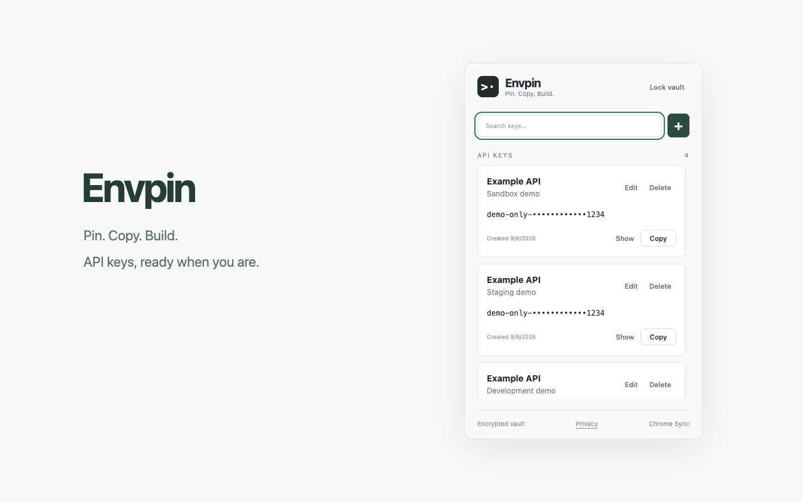
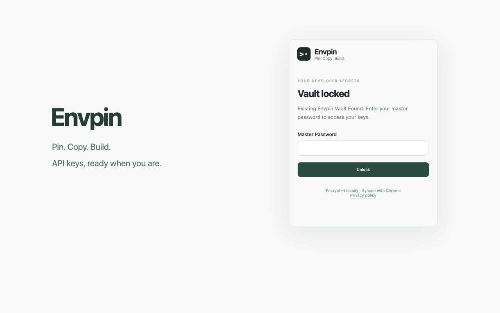

# Envpin

[English](README.md) | **한국어**

**Pin. Copy. Build.**

Chrome에서 사용하는 작고 프라이빗한 API Key Vault입니다. 개발용 Secret을 저장하고, 필요할 때 복사하고, 로컬에서 암호화한 Vault 데이터를 Chrome 설치 간 동기화합니다.

**Envpin 계정 없음 · 자체 서버 없음 · 웹사이트 접근 없음 · Analytics 없음**

[Chrome 웹 스토어에서 설치](https://chromewebstore.google.com/detail/envpin-%E2%80%94-api-key-vault/jbgcepnmfgekljldjlfakmjphbomgkec) · [보안](SECURITY.md) · [개인정보처리방침](PRIVACY.md) · [문제 신고](https://github.com/rheeeuro/envpin/issues)

## 왜 Envpin인가요

API Key는 메모, 메신저, 로컬 `.env` 파일 곳곳에 흩어지기 쉽습니다. Envpin은 방문하는 웹사이트의 접근 권한을 요구하거나 Vault를 Envpin 서버로 보내지 않으면서, 개인 개발자가 Chrome 안에서 소수의 API Key를 빠르게 찾아 쓸 수 있게 합니다.

Envpin은 Chrome의 `storage` 권한만 요청합니다. Secret 원문은 Chrome Sync에 기록되기 전에 로컬에서 암호화되며, Master Password는 저장하지 않습니다.

## 신뢰 모델 요약

| 항목 | Envpin |
| --- | --- |
| Envpin 자체 서버 | 없음 |
| 별도 Envpin 계정 | 필요 없음 |
| 웹사이트 또는 호스트 접근 | 없음 |
| 분석 또는 광고 | 없음 |
| Chrome 권한 | `storage`만 사용 |
| Secret 저장 | 저장 전에 AES-GCM으로 암호화 |
| 기기 간 동기화 | 로컬에서 암호화한 Vault 데이터를 Chrome Sync로 전달 |
| Master Password | 로컬에서만 사용하며 저장하지 않음 |

<p align="center">
  
  
</p>

## 주요 기능

- **한 번에 복사** — 팝업에서 Secret을 바로 복사합니다.
- **빠른 검색** — 서비스명, 키 이름, 웹사이트, 메모를 검색합니다. Secret 원문은 검색하지 않습니다.
- **보기 쉽게 정리** — Manage 페이지에서 자주 쓰는 키를 고정하고 순서를 바꿉니다.
- **기본 마스킹** — 표시한 Secret은 10초 후 다시 가립니다.
- **세션 잠금** — 팝업을 닫아도 잠금 해제 상태를 유지하고, 원할 때 즉시 잠급니다. Chrome을 재시작하면 세션이 지워집니다.
- **암호화 후 동기화** — 로컬에서 암호화한 항목을 Chrome Sync를 통해 다른 Chrome 설치와 동기화합니다.

## 보안 요약

Envpin은 Web Crypto의 PBKDF2-SHA-256 600,000회, 16바이트 무작위 salt, AES-GCM-256을 사용합니다. 암호화할 때마다 새로운 12바이트 IV를 만들며, 현재 Vault 형식은 Vault와 레코드의 컨텍스트를 AES-GCM 추가 인증 데이터에 바인딩합니다.

잠금 해제 중에는 파생된 암호화 키를 Chrome 확장 프로그램의 세션 저장소에 보관하며, 브라우저 세션이 끝나면 지워집니다. Envpin은 복호화한 Secret을 `storage.local`, LocalStorage, IndexedDB 또는 Envpin 서버에 저장하지 않습니다.

Secret을 시스템 클립보드에 복사한 뒤에는 암호화가 보호하지 못합니다. 이미 잠금 해제된 기기의 악성코드나 손상된 브라우저 환경도 방어할 수 없습니다. Envpin은 독립 보안 감사를 받지 않았습니다. 위협 모델과 구현 상세는 [보안 정책](SECURITY.md)과 [개발 및 보안 참고](docs/development.md)를 확인하세요.

## 빠른 시작

1. Envpin을 설치하고 길고 고유한 Master Password로 Vault를 만듭니다.
2. 서비스명, 키 이름, Secret을 추가합니다. 웹사이트와 메모는 선택 사항입니다.
3. 팝업에서 항목을 검색하고 필요할 때 Secret을 복사합니다.

비밀번호 재설정은 없습니다. Master Password를 잊으면 Envpin이 Vault를 복구할 수 없습니다.

## 다른 PC와 동기화

1. 같은 Google 계정으로 Chrome에 로그인하고 확장 프로그램 동기화를 활성화합니다.
2. 다른 PC에도 **동일한 확장 ID의 Envpin**을 설치합니다.
3. 기존 Vault가 동기화될 때까지 기다립니다.
4. `Existing Envpin Vault Found`가 표시되면 기존 Master Password로 잠금을 해제합니다.

Envpin은 Vault 내용을 로컬에서 암호화한 뒤 Chrome Sync에 기록합니다. 2026년 9월 16일 Windows와 macOS 물리 PC 사이에서 Chrome Sync를 통한 생성, 수정, 삭제, 오프라인 복귀, 브라우저 재시작, 동시 수정 시나리오를 검증했습니다. 정확한 범위는 [물리 PC Sync 검증 결과](docs/physical-sync-verification-2026-09-16.md)와 [자동화 검증 결과](docs/verification-0.2.0.md)를 확인하세요.

> 소스에서 직접 설치한 빌드는 Chrome 웹 스토어 버전과 확장 ID가 다를 수 있습니다. 확장 ID가 다르면 Chrome Sync 저장소를 공유하지 않습니다.

## 소스에서 설치

Git과 Node.js 22 이상이 필요합니다.

```sh
git clone https://github.com/rheeeuro/envpin.git
cd envpin
npm ci
npm test
npm run build
```

`chrome://extensions`를 열고 **개발자 모드**를 켠 다음 **압축해제된 확장 프로그램을 로드합니다**를 선택해 생성된 `envpin/dist` 폴더를 지정합니다.

## Vault 사용법

### Vault 만들기

Envpin을 열고 Master Password를 두 번 입력한 뒤 `Create Vault`를 누릅니다. 새 비밀번호는 8자 이상이어야 하며, 길고 고유한 암호문을 권장합니다.

### API Key 추가하기

`+` 또는 `Add API Key`를 누르고 다음 내용을 입력합니다.

| 항목 | 입력 내용 |
| --- | --- |
| Service | 서비스명. 예: OpenAI, GitHub |
| Name | 키를 구분할 이름. 예: Personal, Development |
| Secret | 저장할 API Key 원문 |
| Website | 관련 웹사이트 주소. 선택 사항 |
| Note | 용도나 참고할 메모. 선택 사항 |

### 복사하고 관리하기

- `Copy`는 Secret을 시스템 클립보드에 복사합니다. Envpin은 클립보드를 자동으로 지우지 않습니다.
- `Show`는 Secret을 10초 동안 표시하고, `Hide`는 즉시 가립니다.
- `Edit`는 저장된 항목을 수정합니다.
- `Delete`는 확인 후 암호화된 항목을 제거하고, 오래된 오프라인 기기가 되살리지 못하도록 암호화된 삭제 기록을 남깁니다.
- `Lock vault`는 활성 세션을 즉시 지웁니다.
- `Manage`는 항목을 고정하거나 같은 그룹 안에서 순서를 바꾸는 관리 페이지를 엽니다.

검색 대상은 서비스명, 키 이름, 웹사이트, 메모입니다. Secret 원문은 검색에 포함하지 않습니다.

## 단축키

| 단축키 | 동작 |
| --- | --- |
| `Cmd + K` / `Ctrl + K` | 목록의 검색창으로 이동 |
| `Enter` | 비밀번호 입력이나 저장 폼 제출 |
| `Escape` | 검색어 지우기, 편집 취소 또는 삭제 확인창 닫기 |

## 알려진 제한 사항

- Chrome Sync 저장 용량에는 제한이 있습니다. 암호화된 삭제 기록도 공간을 사용하며, 오래된 오프라인 기기의 항목 부활을 막기 위해 자동 삭제하지 않습니다.
- 가져오기, 내보내기, 백업 복구, 팀 공유는 아직 제공하지 않습니다. 각 Secret의 원래 서비스에서 복구할 수단을 유지하세요.
- 여러 PC에서 같은 항목을 동시에 편집하면 충돌 처리가 필요할 수 있습니다. 다른 기기에서 편집하기 전에 동기화를 기다리세요.
- Envpin은 독립 보안 감사를 받지 않았습니다.

## 로드맵

단기 우선순위는 암호화된 백업과 복구, 설정 가능한 자동 잠금, 클립보드 보호 옵션, Sync 진단 개선입니다. 이후 후보에는 명시적인 `.env` 가져오기·내보내기, 프로젝트 태그, 키보드 중심의 빠른 복사가 있습니다. 로드맵 항목은 제안이며 출시된 기능이 아닙니다.

## 개발 및 검증

```sh
npm test
npm run build
```

`npm run dev`는 UI 개발용입니다. 실제 Vault 기능은 Chrome 확장 프로그램 환경에서 실행하세요. 소스를 바꾼 뒤에는 확장을 다시 빌드하고 Chrome 확장 프로그램 페이지에서 새로고침합니다.

[보안](SECURITY.md) · [개인정보처리방침](PRIVACY.md) · [물리 PC Sync 검증](docs/physical-sync-verification-2026-09-16.md) · [자동화 검증](docs/verification-0.2.0.md) · [수동 QA 체크리스트](docs/manual-qa.md) · [Vault 충돌 대응](docs/recovery.md) · [설계 문서](docs/envpin-design.md)
